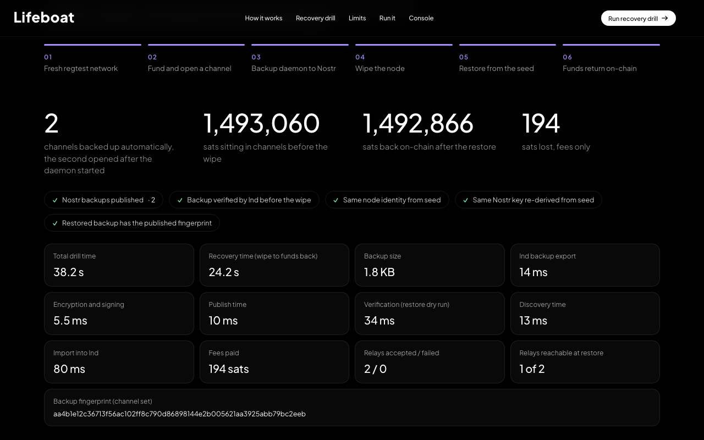
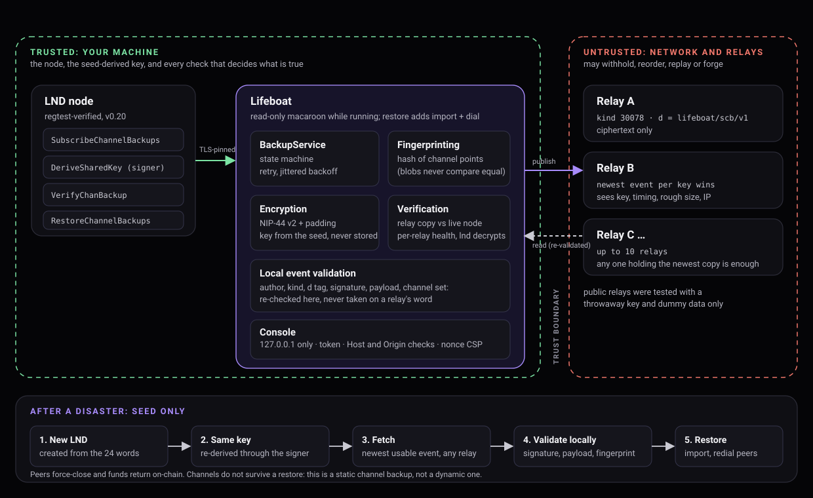

# Lifeboat

**Lifeboat is a TypeScript daemon and console that lets a self-hosted LND operator recover channel funds from the 24-word seed with no other secret or file, by publishing encrypted static channel backups to Nostr relays and verifying them against the live node before they are needed.**

Built for BOSS Battle (Bitshala). Status: verified on regtest with real LND nodes; testnet and mainnet were not run. See [Limitations](#limitations).



## Problem

An LND node's channel state lives on one machine. The static channel backup (SCB) that protects it is a file someone has to keep copying, and it often sits on the machine that just died. If the copy is stale or missing, the money in channels depends on peers, and nothing tells you how to get it back.

## Solution

A small daemon publishes every backup change to several Nostr relays as one encrypted, addressable event. The key that signs and encrypts it is derived from the wallet seed inside LND, so a node recreated from the same 24 words finds its own backup again. "Seed-only" means no other secret or file is needed; the backup itself lives on the relays. A verification step checks the relay copy against the live node, and a drill wipes a regtest node and restores it for real.

## Why Lifeboat

- **Recovery needs only the seed.** No cloud account, no vendor, no second secret.
- **Relays are untrusted.** Every event is re-validated locally; several relays are used; one can be gone.
- **You can check before the disaster.** Verification asks LND itself to decrypt the relay copy and compares the channels inside with the node's, per relay.
- **The restore is rehearsed on real LND nodes**, with measured time, sats and fees.

How it differs from scripts, vendor backups and peer storage: [docs/differentiation.md](docs/differentiation.md). No "first" or "only" claim is made.

## Architecture



Trusted: your machine (LND, the seed-derived key, local validation). Untrusted: relays and the network. More: [architecture](docs/architecture.md), [protocol](docs/protocol.md), [nostr](docs/nostr.md), [technical story](docs/technical-story.md).

## How it works

1. **Back up.** The daemon watches LND's channel-backup stream. On every change it builds `{v, scb, peers, cp}` and encrypts it with NIP-44 to a Nostr key derived from the seed (`DeriveSharedKey` through LND's signer).
2. **Publish.** One kind-30078 event (`d = lifeboat/scb/v1`) goes to every enabled relay; relays keep the newest per key.
3. **Verify.** Fetch from every relay, keep only valid events by our key, ask LND to decrypt the newest usable copy, compare its channels with the node's. Verdicts: `verified`, `degraded`, `failed`; per relay: `healthy`, `stale`, `missing`, `down`.
4. **Restore.** A new LND created from the same seed re-derives the key, fetches, validates, imports the backup and redials the peers until they force-close. Funds return on-chain.

## Security model

Backup payloads are encrypted before relay publication, and relay events are independently validated (author, kind, tag, signature, payload, channel set) before restore or verification. The daemon runs with a read-only macaroon that LND confirms cannot spend; LND traffic is TLS-pinned; the console is loopback-only with token, Host and Origin checks and a nonce CSP; logs redact credentials; mainnet is refused unless explicitly allowed. What it does *not* protect against (compromised host, stolen seed, relay metadata, all relays withholding) is in [docs/security-architecture.md](docs/security-architecture.md) and the [threat model](docs/threat-model.md).

## Recovery drill

`npm run demo` (or the button on the landing page) creates a throwaway regtest network with two LND nodes and two relays, opens two channels, publishes the backup, verifies it, deletes the node, switches one relay off, restores from the seed and the relays and waits for funds. Latest recorded run (2026-09-19): 1,492,866 of 1,493,060 channel sats recovered on-chain, 194 sats in fees, 37.9 s for the whole drill (24.3 s from wipe to funds back), with one of two relays switched off during the restore. Timings vary per run; the page shows the numbers of the run you start. About 15 s of the recovery is a fixed redial schedule, not measured work. Details: [recovery](docs/recovery.md).

## Features

- Backup daemon with a state machine, jittered retry, resubscribe, periodic refresh and self-healing republish
- Verification per relay with LND's `VerifyChanBackup`
- CLI: `pubkey`, `backup`, `verify`, `restore`, `bake`, `relay-test`
- Console (`/console`, 8 tabs): dashboard, backup, verify, relays, node, security, activity, settings
- Least-privilege macaroon baking, confirmed by LND
- Landing page with a live regtest drill; regtest playground with a live node
- `demo:check` (prints `READY` only when every component answered) and `demo:reset` (deletes `<repo>/data` only)

Classification of what is core, stable, optional and experimental: [docs/feature-freeze.md](docs/feature-freeze.md). Test evidence: [docs/test-matrix.md](docs/test-matrix.md).

## Technical stack

TypeScript (Node 22+), LND 0.20 REST, `nostr-tools` (NIP-44, NIP-78), `@noble/curves`, `@noble/hashes`, `ws`. Frontend: two static HTML pages, inline JS, nonce CSP, no framework. Tests: `node:test` via `tsx`, headless Chrome over the DevTools protocol, real-LND e2e. Regtest: Docker (`bitcoind` 30, `lnd` 0.20.0-beta).

## Installation

### Prerequisites

| Needed for | Requirement |
|---|---|
| Everything | Node.js 22 or newer (developed on Node 26; 22 is expected to work but was not tested) and npm |
| `npm run check` | Nothing else. No Docker, no network |
| Browser tests inside `npm run check` | Chrome or Chromium in a usual location, or `CHROME_PATH`; without one those 13 tests are skipped |
| `web` (live drill), `playground`, `demo`, `e2e` | Docker with a running daemon (Docker Desktop or the docker service). The first run pulls `polarlightning/lnd:0.20.0-beta` and `polarlightning/bitcoind:30.0` |
| The same | The repository must be in a folder Docker can bind-mount (on Docker Desktop, a folder under your home directory), because the regtest nodes write into `<repo>/data` |
| The same | Ports 7777, 7778 (relays) and 8080 (page) free, plus 8081, 8082 and 18443 for the Docker containers, all on 127.0.0.1 |

Without Docker, `npm run demo` and `npm run playground` stop within 15 s with one line, `prerequisite failed: Docker daemon: not reachable: start Docker Desktop or the docker service`; the landing page's drill button answers "Docker isn't running" (HTTP 503); `npm run demo:reset` says the containers were not touched. None of them hangs or prints a stack trace (tested).

```bash
git clone [GitHub URL — TO BE ADDED] lifeboat && cd lifeboat
npm install
npm run check          # typecheck + 158 unit and browser tests
```

`npm run check` needs no Docker. Chrome is found automatically on macOS and Linux; set `CHROME_PATH` otherwise (browser tests are skipped if none is found).

### Repository layout

```
src/            TypeScript source; each module has its <name>.test.ts beside it
web/            the two static pages (landing + drill, console)
scripts/        screenshot capture tool
docs/           architecture, protocol, security, threat model, testing, positioning, checklists
submission/     Devfolio copy and links to the maintained documents
screenshots/    real screenshots of the running application
.github/        CI workflow (not run on GitHub yet)
```

## Development

```bash
npm run web                          # landing page + live drill on http://127.0.0.1:8080 (needs Docker)
npm run playground                   # regtest network + console at http://127.0.0.1:8080/console (Ctrl-C tears it down)
npm run playground:open -- 250000    # open another channel and watch the backup follow (playground must be running)
npm run demo                         # the disaster drill in the terminal
npm run demo:check                   # READY only if the running playground answers on every component
npm run demo:reset                   # remove regtest containers and <repo>/data (nothing else)
npm run typecheck
```

Against your own node (regtest first):

```bash
LND_CERT=... LND_MACAROON=<admin> npm run cli -- bake --out monitor.macaroon
LND_CERT=... LND_MACAROON=monitor.macaroon RELAYS=wss://a,wss://b npm run daemon
LND_CERT=... LND_MACAROON=monitor.macaroon RELAYS=wss://a,wss://b npm run cli -- verify
```

Variables are listed in [.env.example](.env.example). There is no build step and no lint script; `npm run typecheck` is the compile check.

## Testing

```bash
npm run check    # typecheck + 158 tests (no Docker)
npm run e2e      # 44 checks against real LND nodes on regtest (Docker, a few minutes)
npm audit        # 0 vulnerabilities on 2026-09-19
```

CI is written (`.github/workflows/ci.yml`) but **has not been run on GitHub**: only the same commands were run locally. See [docs/testing.md](docs/testing.md).

## Regtest demo

`npm run web`, open `http://127.0.0.1:8080/`, press **Run recovery drill**. Script with timings: [docs/demo-script.md](docs/demo-script.md). The regtest network is disposable: `npm run demo:reset` clears it.

## Testnet

**Not tested.** Labels (REGTEST, TESTNET, TESTNET4, SIGNET, MAINNET), the `LIFEBOAT_NETWORK` expected-network guard and the mainnet refusal (`LIFEBOAT_ALLOW_MAINNET=1` needed) are unit-tested against a stubbed node only. Checklist: [docs/testnet-checklist.md](docs/testnet-checklist.md).

## Public relay test

`npm run cli -- relay-test wss://relay.example --yes` publishes one dummy event, signed by a throwaway key in its own namespace and shaped like a backup but made of random bytes, reads it back, validates it, and asks the relay to delete it. It never touches your node or a real backup. One-shot results on four public relays (three passed on some attempt, one was intermittent, one timed out once) are in [docs/public-relay-testing.md](docs/public-relay-testing.md). Retention over time is unmeasured.

## Threat model

[docs/threat-model.md](docs/threat-model.md) (18 actors, each with a mitigation, a test and the residual risk) and [docs/security-architecture.md](docs/security-architecture.md).

## Limitations

- **Restore closes your channels.** Funds return on-chain; channel state does not come back.
- **Peers must be online** to force-close.
- **About 200 channels per backup** (NIP-44's 64 KB plaintext limit; no chunking).
- **Relays can withhold or serve stale data.** Use at least two independent relays; `verify` shows divergence. Public relay durability is unmeasured.
- **Regtest-verified only.** Testnet and mainnet were not run.
- **LND only**, and only LND 0.20 was used.
- **Verified in Chrome only**; Firefox and Safari were not tested.
- **No license file yet** (owner's decision: [docs/license-decision.md](docs/license-decision.md)).

## BOSS Battle track

Submitted under **Freedom Stack**: Nostr as storage and identity for a system whose useful property does not depend on trusting whoever operates it. Honest gap: no ecash. Cypherpunk and Machine Money are weak fits and not claimed. Reasoning: [docs/boss-battle-positioning.md](docs/boss-battle-positioning.md).

## Demo

Two to three minutes, one screen: [docs/demo-script.md](docs/demo-script.md). Screenshots: [docs/screenshots.md](docs/screenshots.md). Video plan: [docs/video-script.md](docs/video-script.md).

## Project status

[FINAL_PROJECT_STATUS.md](FINAL_PROJECT_STATUS.md): what was verified, bugs found and fixed, known limitations and exact next actions. Submission package: [submission/](submission/README-SUBMISSION.md).
