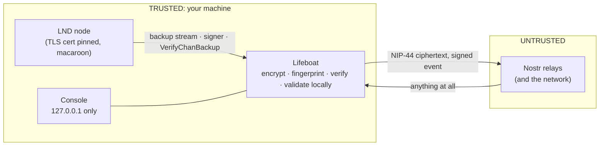

# Security architecture

Scope: what Lifeboat's code does, where, and which test shows it. It is a regtest-verified prototype, so read the last section as carefully as the first. Test names refer to `src/*.test.ts`; "e2e" is `npm run e2e` against real LND.

## Trust boundaries

The picture with more detail is `docs/diagrams/architecture.svg`.

## Controls

| Layer | Control | What it does | Where | Shown by |
|---|---|---|---|---|
| LND transport | TLS, certificate pinned | Requests are verified against the node's own `tls.cert`; a different certificate is refused | `lnd.ts` | `lnd.test.ts` (impostor cert refused) |
| LND transport | Timeouts | Every request times out; a response cut mid-body is an error, never a hang | `lnd.ts` | `lnd.test.ts` |
| LND authority | Macaroons, least privilege | The daemon uses `info:read offchain:read signer:generate peers:read macaroon:read`; restore adds `offchain:write peers:write`. Neither can spend. LND itself is asked | `lnd.ts`, `cli.ts bake` | e2e (send coins, bake and new address denied; `canSpendOnchain`) |
| LND authority | Credential file handling | `bake` creates the file `0600` with exclusive create; loose modes are warned about | `cli.ts`, `config.ts` | `config.test.ts` |
| Keys | Seed-derived backup key | `DeriveSharedKey` against a point with unknown discrete log, hashed with a domain tag; the private key never leaves LND and is never stored | `keys.ts` | `keys.test.ts`, e2e (same key after a wipe) |
| Confidentiality | Encryption | NIP-44 v2 to the key's own public key with padding, on top of LND's own seed-derived SCB encryption | `nostr.ts` | `nostr.test.ts` (relay never holds plaintext) |
| Integrity | Signature and author | Only events by our key, kind 30078, `d = lifeboat/scb/v1`, with a valid signature are candidates | `nostr.ts` (`isOwnValid`, never throws) | `nostr.test.ts`, `hostile.test.ts` |
| Integrity | Payload validation | Version, base64, peer syntax, size, fingerprint format are checked before use; an unusable newer payload cannot hide an older good one | `payload.ts`, `backup.ts` | `payload.test.ts`, `hostile.test.ts` |
| Integrity | Fingerprint and LND validation | The relay copy must match the node's current channel set, decided by the channel list LND itself extracts from the blob | `backup.ts` | `verify.test.ts`, e2e |
| Freshness | Selection rules | Newest usable event wins; duplicates collapse; events more than 10 minutes in the future never shadow a current one | `nostr.ts` | `nostr.test.ts` |
| Console | Loopback bind | The server listens on 127.0.0.1 only | `web.ts`, `serve.ts` | `web.test.ts` |
| Console | Host validation | Requests with a foreign `Host` are refused (DNS rebinding) | `web.ts` | `web.test.ts` |
| Console | Origin validation | Requests with a foreign `Origin` are refused | `web.ts` | `web.test.ts` |
| Console | Per-run token | State-changing endpoints need `x-lifeboat-token`, compared in constant time | `web.ts` | `web.test.ts` |
| Console | CSP and headers | Nonce-based CSP for scripts and styles, no third-party media, `frame-ancestors 'none'`, `nosniff`, `no-referrer`, `no-store` | `web.ts` | `web.test.ts`, `ui.test.ts` |
| Console | Output encoding | All dynamic values are rendered as text | `web/console.html` | `ui.test.ts` (hostile strings, mutation-checked) |
| Availability | Caps and timeouts | 16 KB request bodies, at most 20 SSE clients, slow SSE clients dropped, single-flight for drill, verification and relay test, retry backoff with jitter | `web.ts`, `sse.ts`, `monitor.ts`, `backup.ts` | `web.test.ts`, `sse.test.ts`, `monitor.test.ts`, `backup.test.ts` |
| Logging | Redaction | Values under keys such as macaroon, mnemonic, seed, password, token, secret, private, nsec, authorization are redacted; large blobs are shortened | `log.ts` | `log.test.ts` |
| Safety | Mainnet guard | Mainnet is refused unless `LIFEBOAT_ALLOW_MAINNET=1`; `LIFEBOAT_NETWORK` refuses any other node | `config.ts`, `monitor.ts` | `config.test.ts`, `monitor.test.ts` |
| Safety | Reset scope | The reset can only delete `<repo>/data`; links are not followed | `demo-env.ts` | `demo-env.test.ts`, run from three working directories |
| Hygiene | Regtest Docker ports | Published on 127.0.0.1 only | `docker-compose.yml` | inspected |
| Persistence | None | No database, no files except an optional baked macaroon. State is in memory; the durable copy is the relay event | design | |

## What Lifeboat does not protect against

- **A compromised machine.** Malware on the host can read the macaroon file, the process memory and the console token.
- **A stolen seed.** The seed already controls the funds and can re-derive the backup key.
- **Other users of the same machine.** Any local process can read the console token from `/api/config`. The console is not a multi-user service and must not be exposed or proxied.
- **Relay metadata.** Relays see the backup public key, when it publishes, roughly how large the backup is (padding buckets) and your IP. There is no Tor or proxy support.
- **Relays withholding or losing every copy.** Integrity does not depend on relays; availability does. Use several independent relays and `verify`.
- **An old-but-valid backup being served** (rollback) between a channel opening and the next publish: recovery would not include the newest channel.
- **Peers that refuse to force-close.** Inherent to static channel backups.
- **A malicious or buggy LND**, or malicious Docker images used by the regtest tools.
- **Rate limiting of arbitrary clients.** There is no per-IP limiter; the console is loopback-only and protected by caps and timeouts instead.
- **Google Fonts.** Both pages load fonts from Google, which learns that a page was opened.
- **Anything on testnet or mainnet**, which were not run.

Nothing here should be summarised as "secure". The accurate summary is in the README: encrypted before publication, independently validated before use, least-privilege credentials, and a local-only console.
